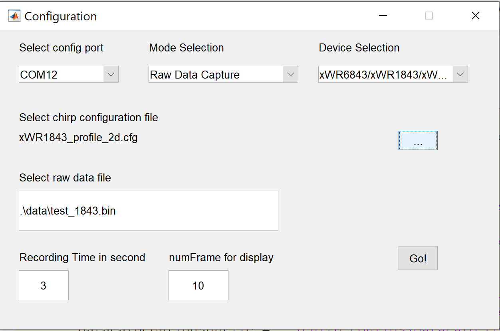

# Raw ADC Data Capture Tool with DCA100 and Matlab

MMWAVE-SDK OOB (out-of-box) demo supports raw ADC data streaming through the LVDS interface. When the radar EVM board connected with the DCA1000EVM board. Users can use the DCA1000EVM CLI application to capture the raw data without starting the mmWaveStudio GUI interface.
This instruction will provide the details how to setup hardware (awr1843boost + DCA1000 fpga ethernet card) and run matlab application for raw ADC data (IQ data) collection, post processing once the capture is done.

## Hardware setup
Please follow the below check points for properly hardware setup
### awr1843boost
    1. SOP2:0 --> 011 (Mmwave Studio) --> 001 (DCA1000 CLI)
    2. S2 mux --> SPI
    3. 5V power supply
    4. Plug micro USB for command UART
### dca1000 
    1. LVDS mode sel --> as per Figure 1
    2. 5V power supply
    3. Plug micro USB for RADAR_FTDI
    4. Ethernet cable PC <--> DCA1000
 

<figcaption><b>Figure 1: AWR1843 + DCA1000 hardware setup</b></figcaption>
 
 

<figcaption><b>Figure 2: AWR1843 + DCA1000 wiring diagram</b></figcaption>
 
 

<figcaption><b>Figure 2: AWR1843 + DCA1000 wiring diagram</b></figcaption>
 
## Raw ADC capture using Mmwave Studio
### Mmwave Studio installation
The following software should be installed before starting the mmWaveStudio

    1. Install mmWaveStudio from the installer package: https://www.ti.com/tool/MMWAVE-STUDIO
    2. Install 32-bit Matlab Runtime Engine (Version 8.5.1): https://in.mathworks.com/supportfiles/downloads/R2015a/deployment_files/R2015aSP1/installers/win32/MCR_R2015aSP1_win32_installer.exe
    3. Install FTDI Drivers: FTDI USB Driver (FTDI drivers will be installed automatically at the end of mmwavestudio installation. This step is only required if the automatic FTDI installation fails)
    4. Install Microsoft Visual C++ 2013 Redistributable package if using a Windows 10 machine from the link https://support.microsoft.com/en-us/help/3179560

### Mmwave Studio startup
After the installation is complete, the GUI executable and associated files will reside in the following directory: C:\ti\mmwave_studio_<ver>\mmWaveStudio

    1. Power up the DCA1000 and the xWR1843 BOOST-EVM
    2. To start the GUI, click on the file called “mmWaveStudio.exe", located under C:\ti\mmwave_studio_<ver>\mmWaveStudio\RunTime folder.
    3. Note: MmWave Studio should to be started in Administrator Mode
 

<figcaption><b>Figure 3: MmWave Studio start up in Admin mode</b></figcaption>
 

    4. Follow the step number per GUI instruction and select Lua script to run
 

<figcaption><b>Figure 4: MmWave Studio run steps</b></figcaption>
 
 

<figcaption><b>Figure 5: Run Lua script</b></figcaption>
 
 

<figcaption><b>Figure 6: Matlab Post Processing</b></figcaption>
 

## Raw ADC capture using Matlab and DCA1000VM_CLI (Mmwave Studio not required)
Run rawDataCaptureGUI_DCA1000CLI.m matlab script, located under matlabCaptureTool folder.

    1. Select command COM port
    2. Select xWR1843 platform Type
    3. Browse to *.cfg file
    4. Select save folder for *.bin file

 

<figcaption><b>Figure 6: Raw ADC Capture GUI</b></figcaption>
 

2D FFT processing will run automatically after ADC data capture done.

 

<figcaption><b>Figure 7: Post processing - 2D FFT Non-Coherent Combination</b></figcaption>
 

### Awr1843AoP EVM and DCA1000
#### Hardware setup
 

<figcaption><b>Figure 8: Awr1843AoP EVM and DCA1000 wiring diagram</b></figcaption>
 

#### Run Mmwave Studio
Repeat the same steps as awr1843boost, however please run a customized Lua script for awr1843AoP: matlabCaptureTool\Lua_scripts\DataCaptureDemo_xWR_1843Boost.lua

#### Run Matlab and DCA1000EVM CLI
Repeat the same steps as awr1843boost